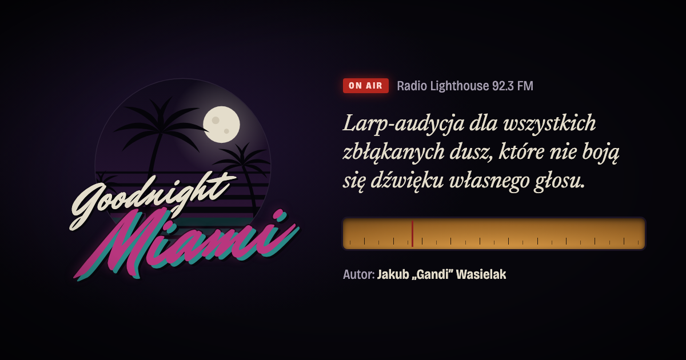

# Goodnight Miami

Strona z design dokiem larpa-audycji **Goodnight Miami**. Design doc ma formę radiowego ogłoszenia Radia Lighthouse 92.3 FM i można go odsłuchać prosto ze strony.

**https://goodnight-miami.com**



## O larpie

Goodnight Miami to larp-audycja. Gracze wcielają się w obsługę stacji radiowej położonej daleko od miasta i przez całą grę dbają o to, żeby audycja trwała. Puszczają muzykę, odbierają telefony i rozmawiają ze słuchaczami na antenie. Tego wieczoru Miami nie zaśnie spokojnie. Do portu zawinął właśnie nieoznakowany kuter, który na zawsze odmieni los tego miasta.

Autor: Jakub „Gandi” Wasielak

## Struktura

```
index.html              strona główna
404.html                strona błędu dla GitHub Pages
assets/css/style.css    style
assets/js/radio.js      odtwarzacz: skala strojenia, fala w głośniku, śledzenie zapisu
assets/audio/           nagranie design docu
assets/img/             emblemat, favicon, ikony i obrazek do udostępniania (OG)
tools/                  źródła HTML obrazków i skrypt do ich renderowania
CNAME                   domena dla GitHub Pages
```

## Uruchomienie lokalne

Strona jest statyczna i nie wymaga budowania. Uruchom ją przez serwer HTTP, a nie przez `file://`. Inaczej przeglądarka zablokuje analizę dźwięku i fala w głośniku zostanie zastąpiona animacją.

```sh
npx http-server -p 8765 -c-1
```

Następnie otwórz http://localhost:8765.

## Obrazki

Obrazek OG i ikony są renderowane z plików w `tools/` przez Chrome w trybie headless:

```sh
./tools/render-images.sh
```

## Publikacja

Strona jest hostowana na GitHub Pages z gałęzi `main`, pod domeną ustawioną w pliku `CNAME`.

## Licencja

© 2026 Jakub „Gandi” Wasielak. Wszelkie prawa zastrzeżone. Szczegóły w pliku [LICENSE](LICENSE).

Strona powstała przy pomocy [Claude Code](https://claude.com/claude-code).
